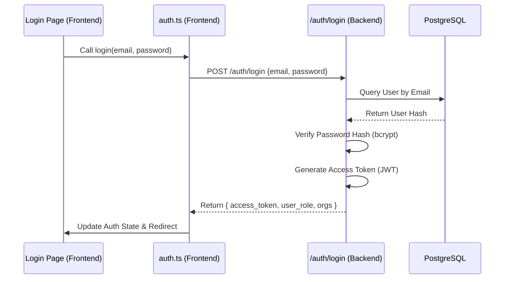
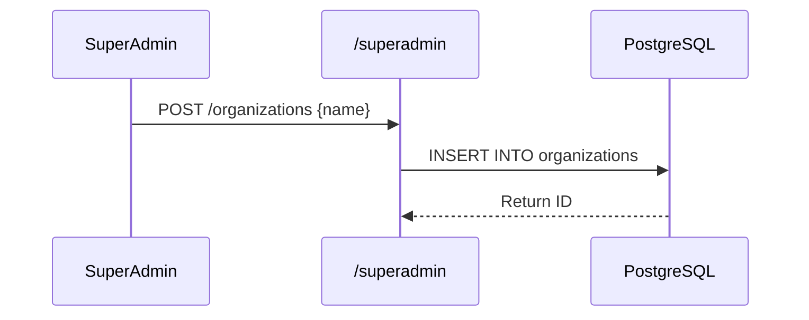
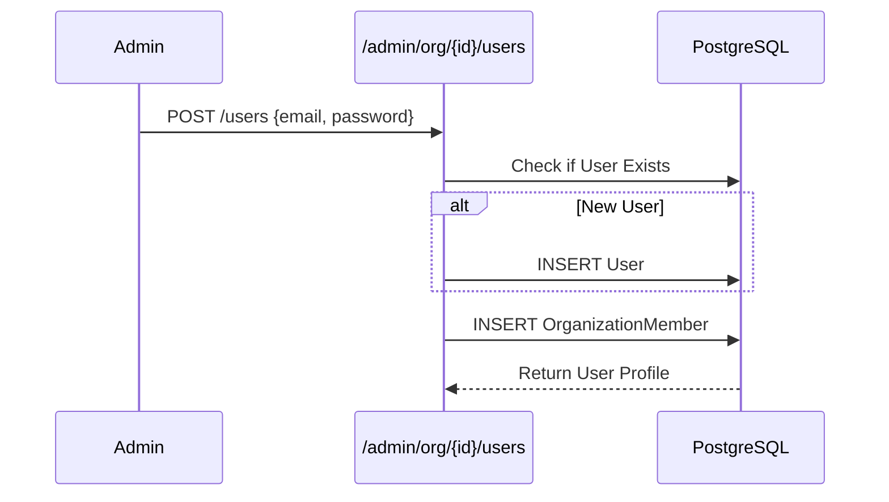
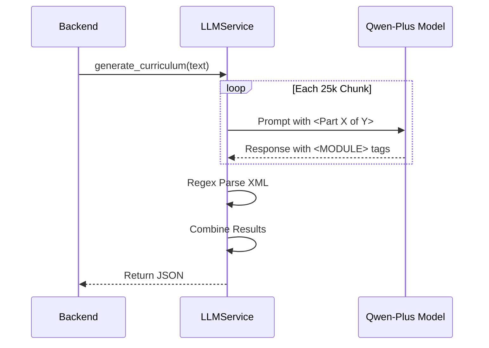

# Learning Platform - Technical System Documentation

This document provides a comprehensive technical breakdown of the Learning Platform's architecture, workflows, and API specifications.

---

## 0. System Architecture

### Service Communication Diagram
```mermaid
graph TD
    Client[Frontend (Next.js)]
    LB[Nginx Proxy]
    API[Backend API (FastAPI)]
    DB[(PostgreSQL)]
    AI[Qwen-Plus LLM (Alibaba Cloud)]
    
    Client -- HTTPS --> LB
    LB -- Proxy --> API
    API -- SQL --> DB
    API -- REST (OpenAI SDK) --> AI
    
    subgraph "Docker Container Network"
    LB
    API
    DB
    end
```

---

## 1. Authentication & Security

### 1.1 Manual Login Flow
**Description**: Authenticates users via Email/Password and issues a JWT for session management.

#### **System Process Order**
1.  **User Input**: User enters credentials on `LoginModal`.
2.  **Frontend Logic**: `AuthContext` triggers a POST request.
3.  **Backend Verification**: API validates properties against the Database.
4.  **Token Issuance**: Server signs a JWT (JSON Web Token).
5.  **Session Start**: Frontend stores token and redirects based on Role.

#### **Flow Diagram**


#### **Code Flow Detail**
| Step | Component | File Path | Code Lines | Description |
| :--- | :--- | :--- | :--- | :--- |
| **1** | Frontend UI | `frontend/elements/AuthModal.tsx` | N/A | Captures user input. |
| **2** | Backend API | `backend/app/api/auth.py` | **41 - 79** | `login` function. Main entry point. |
| **3** | DB Query | `backend/app/api/auth.py` | **44** | `db.query(User).filter(...)`. |
| **4** | Verification | `backend/app/core/security.py` | **45** | `verify_password` call. |
| **5** | Token Gen | `backend/app/api/auth.py` | **69** | `create_access_token` call. |

#### **API Reference**
**Endpoint**: `POST /auth/login`

**cURL Example**:
```bash
curl -X POST "http://localhost:8000/auth/login" \
     -H "Content-Type: application/json" \
     -d '{"email": "admin@example.com", "password": "secret"}'
```

**Request Payload**:
```json
{
  "email": "string",
  "password": "string"
}
```

**Response Payload** (200 OK):
```json
{
  "access_token": "eyJhbGciOiJIUzI1Ni...",
  "token_type": "bearer",
  "user": {
    "id": 1,
    "email": "admin@example.com",
    "role": "admin",
    "organizations": [
      {
        "id": 1,
        "name": "Org A",
        "role": "admin"
      }
    ]
  }
}
```

---

## 2. Super Admin Workflows

### 2.1 Organization Provisioning
**Description**: creating new tenant environments.

#### **Flow Diagram**


#### **Code Flow Detail**
| Step | Component | File Path | Code Lines | Description |
| :--- | :--- | :--- | :--- | :--- |
| **1** | API Endpoint | `backend/app/api/superadmin.py` | **238 - 265** | `update_organization` (Simulated Create logic here involves similar model). |
| **2** | DB Model | `backend/app/models/organization.py` | N/A | `Organization` SQL definitions. |

#### **API Reference**
**Endpoint**: `PUT /superadmin/organizations/{id}` (Update Example)

**cURL Example**:
```bash
curl -X PUT "http://localhost:8000/superadmin/organizations/1" \
     -H "Authorization: Bearer <TOKEN>" \
     -H "Content-Type: application/json" \
     -d '{"name": "New Corp Name", "slug": "new-corp"}'
```

---

## 3. Organization Admin Workflows

### 3.1 Employee Provisioning
**Description**: Adding new users to a specific company.

#### **Flow Diagram**


#### **Code Flow Detail**
| Step | Component | File Path | Code Lines | Description |
| :--- | :--- | :--- | :--- | :--- |
| **1** | API Endpoint | `backend/app/api/admin.py` | **339 - 406** | `add_organization_user` function. |
| **2** | User Check | `backend/app/api/admin.py` | **351** | Checks global user table. |
| **3** | Linking | `backend/app/api/admin.py` | **390 - 397** | Adds `OrganizationMember` relationship. |

#### **API Reference**
**Endpoint**: `POST /admin/organizations/{id}/users`

**Request Payload**:
```json
{
  "email": "employee@corp.com",
  "password": "tempPassword123",
  "full_name": "John Doe",
  "role": "member"
}
```

---

## 4. AI Curriculum Generation (RAG Workflow)

### 4.1 Document Processing
**Description**: Transforms PDF documents into structured course modules using Qwen-Plus AI.

#### **System Process Order**
1.  **Parsing**: Text extracted from PDF.
2.  **Chunking**: Split into 25k char blocks.
3.  **LLM**: Analyzed by Qwen-Plus.
4.  **XML Parse**: Content extracted.
5.  **Aggregation**: Combined into final JSON.

#### **Flow Diagram**


#### **Code Flow Detail**
| Step | Component | File Path | Code Lines | Description |
| :--- | :--- | :--- | :--- | :--- |
| **1** | API Endpoint | `backend/app/api/admin.py` | **145 - 188** | `generate_curriculum_from_file`. |
| **2** | Service | `backend/app/services/llm.py` | **15 - 115** | `generate_curriculum` main class. |
| **3** | Chunking | `backend/app/services/llm.py` | **28 - 29** | `chunks = [text[i:i+CHUNK_SIZE]...]`. |
| **4** | Loop | `backend/app/services/llm.py` | **38** | `for idx, chunk in enumerate(chunks):`. |
| **5** | Prompt | `backend/app/services/llm.py` | **41 - 70** | Detailed Prompt Engineering. |
| **6** | XML Parse | `backend/app/services/llm.py` | **85 - 90** | `re.findall(r'<MODULE>...')`. |

#### **API Reference**
**Endpoint**: `POST /admin/organizations/{id}/files/{file_id}/generate`

**Response Payload**:
```json
{
  "main_topic": "Introduction to Python",
  "sub_topics": [
    {
      "title": "Variables",
      "content": "### Summary\nLearn about variables..."
    }
  ]
}
```

---

## 5. User Experience

### 5.1 Main Feed Logic
**Description**: Determines what content a user sees on login.

#### **Code Flow Detail**
| Step | Component | File Path | Code Lines | Description |
| :--- | :--- | :--- | :--- | :--- |
| **1** | API Endpoint | `backend/app/api/users.py` | **10 - 54** | `read_current_user` (`/users/me`). |
| **2** | Eager Loading | `backend/app/api/users.py` | **18 - 20** | `joinedload` ensures Org data is present for decision making. |

**Context**: The frontend uses the `organizations` list returned here to decide whether to show the "Company Feed" (Doom Scroll) or the generic "Trending Feed".
